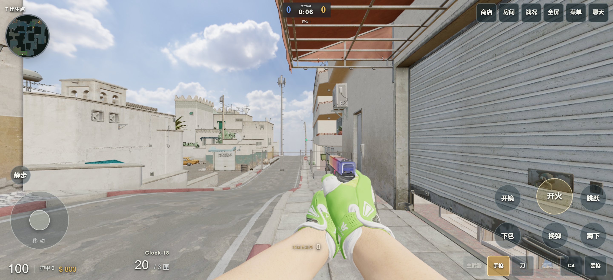
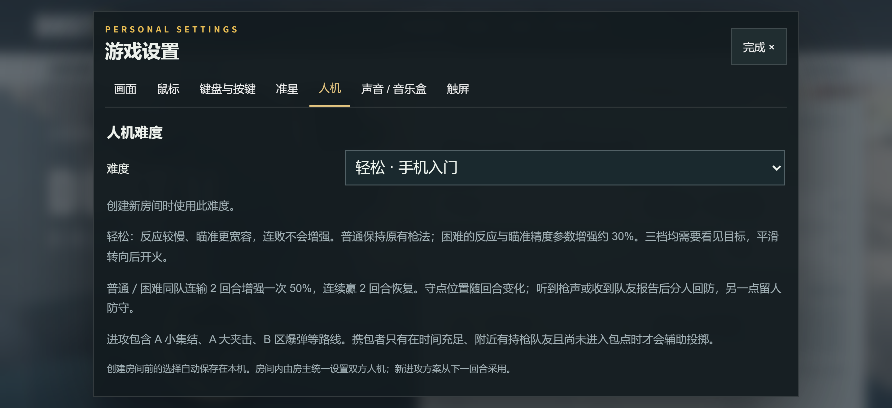

# DUST II · 离线版 0.2.0

**用 GPT-6，把沙二装进口袋。断网，也能开一局。**

[Android APK / Windows ZIP 下载](https://github.com/ETO-ze/dust2-web/releases/tag/offline-v0.2.0) · [这一版改了什么](docs/OFFLINE-0.2.md) · [安装与构建](docs/OFFLINE-V1.md) · [验证记录](docs/validation/offline-v0.2.0.md)

地图、枪械、皮肤、探员与音乐随包提供。1 名玩家与最多 9 名人机，支持 5v5 席位、13 胜爆破和 100 击杀团队死斗。Android 与 Windows 分别下载，首次进入也无需联网获取素材。

*当前构建的桌面 Chrome 触屏模拟截图，960×440 CSS 像素；不是 P60 真机性能展示。*

## 这一版，让队友多一点配合

| 更新 | 对局中的变化 |
| --- | --- |
| 三档难度 | 新增轻松档，适合手机入门；普通／困难保留视觉瞄准、平滑转向与原有枪法差异。 |
| 守点变化 | 出生更分散，守点候选经过落脚、视线和路线检查，随回合轮换，继续支持换位与 peek。 |
| 分人回防 | 依据听到的枪声和队友报告派人支援，连续枪声不再把新回防计时不断推后，另一点保留守备。 |
| 道具配合 | 更积极寻找附近投掷位，同时限制绕路；携包人机有持枪队友保护、时间充足时也可辅助投掷。 |
| 熟悉的规则 | 普通／困难连输 2 回合增强一次 50%，连赢 2 回合恢复；轻松档不额外增强。 |

## 手机上手，按自己的习惯来

左手摇杆移动，右手滑动瞄准；开火、开镜、跳跃、蹲下、切枪、投掷和拾取都有触屏按键。可以拖动按键、调整大小与透明度，并导出布局代码。

画质、清晰度和帧率分别可调，保留亮度、16:9／4:3 与准星设置。默认最低画质、60 FPS 上限；对局逻辑运行在独立 Worker 中。暂停菜单和切后台会暂停游戏，返回后继续。

商店购买与退枪、护甲和拆弹器、五类道具、C4、捡枪丢枪、经济与人机配合、死亡观战和接管队友继续保留。退出应用后重新开局，当前不保存局内进度。

## 下载与安装

- **Android：** 下载 APK 后安装。需要 Android 8+、WebGL 2 与 WebView 110+。可与原在线版共存；0.1.0 可覆盖升级，保留应用设置。
- **Windows 10/11 x64：** 完整解压 ZIP，双击「开始游戏.cmd」，用 Edge/Chrome 打开。包内含运行时，无需另装 Node；游戏时保留启动窗口。
- 设置可从「本地资源」导出备份。手机实际帧率取决于设备、温度与人机数量。

## 开发与来源

本分支是单人离线版本，不支持异地联机。原在线项目保留在 [main 分支](https://github.com/ETO-ze/dust2-web/tree/main)，在线服务与本次安装包独立更新。

参考 [henhaogame/dust2-offline](https://github.com/henhaogame/dust2-offline) 的离线、触控和部分人机设计，采用独立模块实现，具体取舍见[更新说明](docs/OFFLINE-0.2.md)。

个人体验项目，非 Valve 官方 CS2，也不含 Source 2 引擎。素材、音乐和第三方组件归属见[许可说明](LICENSE.md)与[素材来源](docs/ASSETS.md)。
