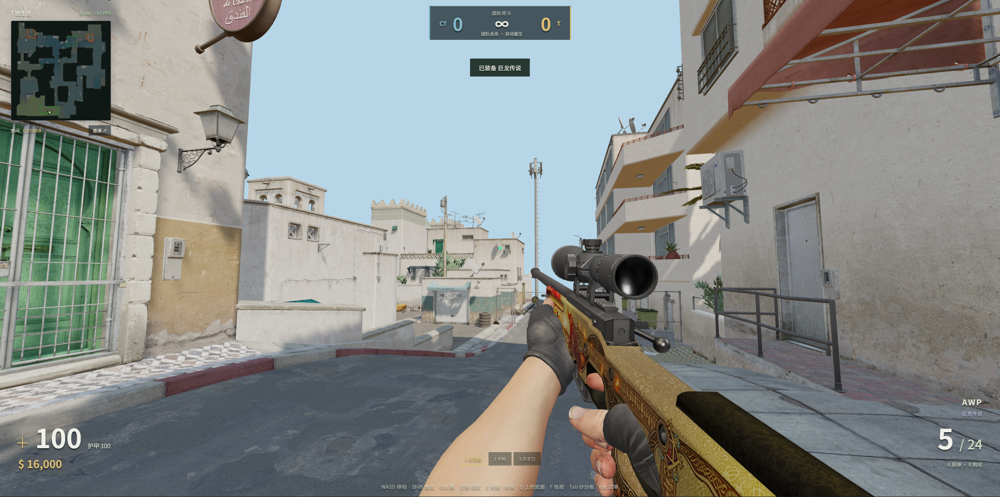
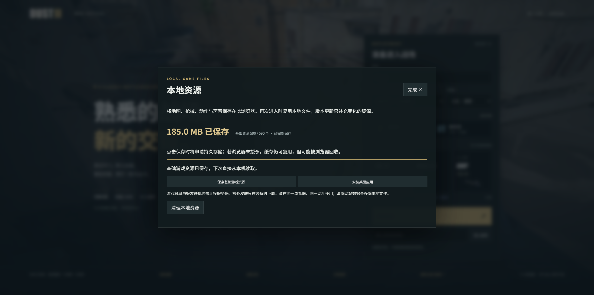

<div align="center">

# DUST II · 网页对战

**熟悉的沙城，一条链接，和朋友开一局。**

在浏览器里走进 Dust II：选阵营、买装备、检视皮肤，从中门的第一枪开始。

[在线试玩](https://duskrain.cn/dust2/) · [游戏实拍](docs/SHOWCASE.md) · [本地运行](#本地运行) · [当前边界](#当前边界)

**Three.js / WebGL2 · Node.js / WebSocket · 多人房间 · 机器人 · PWA**

</div>



*浏览器内实际运行画面。AWP 巨龙传说为可选皮肤，默认装备为永恒之枪。*

## 从大厅到第一枪

打开 [在线游戏](https://duskrain.cn/dust2/)，填写名字，选择 T、CT 或自动平衡，再创建房间。点击「邀请」把链接发给朋友，即可跨网络加入同一场对局；也可以加入机器人独自练习。每个房间最多容纳 10 名玩家，人类加入时机器人会让出位置。

首次进入会下载地图、模型和声音，并显示真实下载进度。想把基础资源留在本机，可以在大厅打开「本地资源」并点击「保存基础游戏资源」。之后复用缓存，版本更新只补充变化的文件。支持的浏览器还可以将它安装为桌面 PWA。

进入对局后点击「继续游戏」控制角色；打开商店或设置时恢复鼠标。游戏面向支持 **WebGL2 和鼠标锁定的桌面浏览器**，建议使用近期版本的 Chrome 或 Edge。

## 已经可以玩什么

| 体验 | 当前实现 |
| --- | --- |
| **两种对局** | 团队死斗支持自动重生和免费补给；经典爆破包含购买、携带炸弹、A/B 安装、拆除、爆炸与回合结算。 |
| **有朋友，也有对手** | 分享房间链接联机，开局选择阵营；机器人沿导航网格移动并参与战斗。 |
| **有模型的第一人称** | CS2 武器与手臂骨骼，31 个原动作片段；拔枪、开火、换弹、检视与 AWP 拉栓。 |
| **枪响之后有回应** | 原版枪声与动作音效；服务器确认命中伤害、爆头、击杀和连杀提示。 |
| **熟悉的操作习惯** | B 键商店、Q 切回上一把、自定义键位与滚轮跳；AWP 两档开镜、独立开镜灵敏度。 |
| **自己的外观与准星** | 18 款皮肤可选；额外皮肤装备时才下载，外观同步给房间里的玩家；支持 CS 准星分享代码。 |
| **下次少等一会儿** | 按资源哈希缓存、本地资源管理、加载失败重试与桌面 PWA。 |

### 装备，按自己的喜好来


*B 打开装备商店。死斗模式免费补给；爆破模式按资金、购买区域与购买时间检查，购买结果由服务器确认。*


*仓库按武器分类，显示当前装备与下载大小。这里的卡片使用库存预览图；装备后，实际 3D 武器也会换成对应皮肤。*

默认搭配为 **AK-47 野荷、M4A1-S 澜磷、AWP 永恒之枪、Glock-18 伽马多普勒绿宝石、USP-S 印花集、爪子刀多普勒蓝宝石**。其余 12 款在玩家装备时下载，并保存在当前浏览器中。

### 开枪，有看得见的结果


*本地联机测试房间的真实运行截图：对手为明确标注的 QA 目标，AWP 命中后出现服务器确认的击杀提示。这张图用于展示反馈效果，不代表公开匹配战绩。*

### 保存资源，下次直接进场



*地图、枪械、动作与声音可以保存在浏览器；额外皮肤仍按需下载。图片中的数量与体积来自截图时的版本。*

PWA 安装的是网页应用入口与缓存。断网可以打开已缓存的大厅，**游戏对局与好友联机仍需连接服务器**。缓存属于当前网站和浏览器；清除网站数据会移除它。浏览器是否授予持久存储权限，会在界面中如实显示。

## 默认操作

所有已实现的动作都可在「游戏设置 → 键位」中重新绑定，支持按键冲突交换与恢复默认。

| 按键 | 动作 |
| --- | --- |
| W / A / S / D | 前后左右移动 |
| 鼠标 / 左键 | 瞄准 / 开火 |
| 右键 | AWP：一档开镜 → 二档开镜 → 退镜 |
| 空格 / Shift / Ctrl | 跳跃 / 静步 / 蹲下 |
| R | 换弹 |
| 1 / 2 / 3 | 主武器 / 手枪 / 刀 |
| Q / 滚轮 | 上一把使用的武器 / 上下切换武器 |
| B / F | 购买装备 / 检视武器 |
| 按住 E | 使用、安装或拆除炸弹 |
| 按住 Tab / Esc | 计分板 / 游戏菜单 |

AWP 两档采用 CS 的 **4:3 基准水平 FOV 40° / 10°**，转换后供 Three.js 相机使用。鼠标灵敏度采用 `0.022° × sensitivity` 的每计数角度规则，开镜灵敏度独立设置；原始鼠标输入能否直接使用，取决于浏览器支持。

默认准星取自 [Total CS 记录的 donk 2026-09-06 Spirit vs MOUZ / Nuke 比赛](https://totalcsgo.com/crosshairs/donk)，并不意味着选手永远使用这一组设置：

```text
CSGO-VeUo2-qw76k-xJeKX-izb9a-GVOAK
```

可以导入其他 CS 分享代码，也可以调整颜色、长度、间距、粗细、描边与后坐力跟随。实现依据与解码逻辑见 [shared/cs2-settings.js](shared/cs2-settings.js)。

## 本地运行

需要 **Node.js 22.12 或更新版本**、npm，以及支持 WebGL2 的桌面浏览器。项目源码与大体积运行资源分开管理。

```bash
npm ci
npm run assets:fetch
npm run build
npm start
```

然后打开 **[http://localhost:3000/](http://localhost:3000/)**。`assets:fetch` 为本地服务准备运行资源，并校验文件哈希；服务器持有可选皮肤文件，玩家浏览器仍只在装备时下载。首次准备需要网络和相应素材的使用权限，详见[资源获取与归属说明](docs/ASSETS.md)。

Windows 也可在依赖与资源准备完成后双击 `Start-Game.cmd`。`Stop-Game.cmd` 只停止该启动器记录的本项目进程。改动前端时运行 `npm run dev`，Vite 默认使用 `5178` 端口，将 `/ws` 转发到已启动的本地服务器。

```bash
npm test
```

测试覆盖输入边沿、跳跃与碰撞、武器与购买、双客户端同步、爆破状态、机器人、皮肤和缓存等逻辑。自动化检查不等同于所有设备上的长时间游玩验证。

## 项目结构

```text
client/       Three.js 场景、第一人称武器、HUD、声音、设置与缓存界面
server/       WebSocket 房间、游戏循环、机器人与服务器判定
shared/       双端共用的运动规则、武器、地图数据与 CS 设置换算
public/       静态入口资源、PWA 文件及按清单获取的游戏素材
config/       运行资源文件与校验清单
scripts/      构建、资源准备、本地启动与验证工具
tests/        运动、战斗、联机与界面逻辑回归测试
deploy/       独立目录、systemd 服务与 Nginx 路由部署
docs/         项目实拍、素材说明与展示文案
```

渲染由 **Three.js** 驱动，碰撞使用 **three-mesh-bvh**；客户端进行本地移动预测和远端玩家插值。**Node.js + WebSocket** 负责房间状态，服务器判定移动、弹药、命中、血量、购买与爆破结果。

公网部署需要 HTTPS 和 WebSocket 转发。已有部署脚本使用独立目录、独立服务与 `/dust2/` 路由；凭据不应写进仓库。资源体积较大，下载速度与解码时间也会影响首次进入体验。

## 当前边界

这是一个正在迭代的个人网页 FPS，由独立实现的游戏逻辑驱动，**不是官方 CS2 客户端或 Source 2 引擎移植**。

- 地图保留 CS2 场景几何、原 UV 与纹理；Source 2 的完整烘焙光照、多层材质、皮肤磨损及珠光效果由网页 PBR 近似呈现。
- 第一人称使用 CS2 手臂和武器动作；远端角色使用 Quaternius 动画模型。碰撞与机器人导航使用经过对齐的 Awpy 数据。
- 尚未实现回溯式延迟补偿、竞技反作弊、账号系统、持久战绩和语音聊天；武器与模式规则也没有覆盖 CS2 全部内容。
- 当前已收到**死亡后弹出菜单、需要再次点击继续**，以及**长时间运行后可能闪退**的反馈，仍待修复与复测。闪退原因尚未确认，不能据此认定是服务器性能问题。

## 素材与致谢

Counter-Strike、Dust II、相关地图、武器、皮肤、手臂、动作、图像与音效的权利归 **Valve 及相应权利人**。本项目没有 Valve 官方关联或背书。素材可公开访问并不等于获得任意再分发许可，项目代码的许可也不会自动覆盖第三方素材。

感谢以下项目、工具和资源提供者：

- [Valve / Counter-Strike](https://www.counter-strike.net/cs2)：原始游戏与[工坊资料](https://www.counter-strike.net/workshop/workshopresources)。
- [Three.js](https://threejs.org/)、[three-mesh-bvh](https://github.com/gkjohnson/three-mesh-bvh) 与 [ws](https://github.com/websockets/ws)：网页渲染、空间查询与实时通信。
- [ValveResourceFormat / Source 2 Viewer](https://github.com/ValveResourceFormat/ValveResourceFormat)：Source 2 资源检查与转换工具。
- [Awpy](https://github.com/pnxenopoulos/awpy)：地图碰撞与导航数据。
- [Quaternius](https://quaternius.com/packs/ultimatemodularcharacters.html)、[Kenney](https://kenney.nl/assets/impact-sounds)：角色动画、脚步及相关 CC0 素材。
- [Total CS](https://totalcsgo.com/crosshairs/donk) 与 [csgo-sharecode](https://github.com/akiver/csgo-sharecode)：准星比赛记录与分享代码格式参考。

详细资源获取方式、校验清单和素材归属见 [docs/ASSETS.md](docs/ASSETS.md)。仓库中的[游戏实拍](docs/SHOWCASE.md)来自本项目浏览器运行过程，未经合成修饰。
