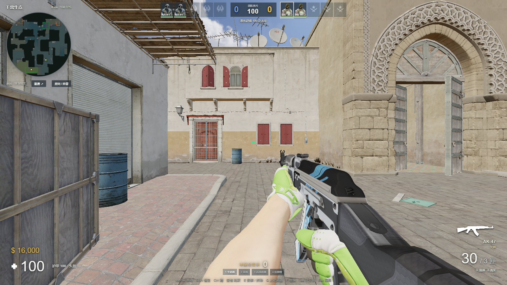
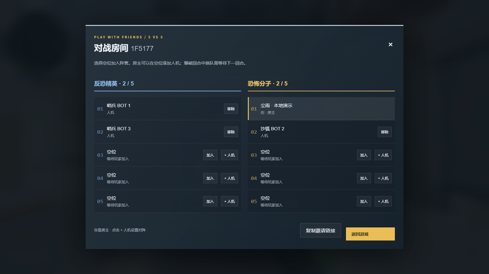

<div align="center">

# DUST II · 网页战术对战

**用 GPT-6，把沙二做进浏览器。**

电脑与手机，同一张 Dust II。创建房间、邀请朋友，或者带上人机开一局。

[立即开局](https://cs2.duskrain.cn/) · [安卓全屏客户端](docs/ANDROID.md) · [新版实机截图](docs/SHOWCASE.md) · [本地运行](#本地运行)

**5 对 5 房间 · 爆破 / 团队死斗 · 手机触控 · 按需下载 · 本地缓存**

</div>



*2026-09-13 当前构建的本地浏览器实拍。演示房间用于展示功能，不代表公开匹配战绩。*

## 现在可以怎么玩

**本次更新：** 爆头与伤害 / 闪光助攻、回合结束后的射击拾枪、分类道具音效，以及八套进攻路线和全队 ECO / 半起 / 强起 / 全起决策。购买计划仅己方可见。[完整更新与验证 →](docs/ROUND-TACTICS-ECONOMY.md)

此前的服务器射击确认与卡顿补偿继续保留。[射击修复与验证 →](docs/FIRING-FIX.md)

普通 / 困难人机、A 小与 B 区烟闪火配合、失败路线恢复、B 狗洞碰撞和观战准星也已上线。[人机更新说明 →](docs/BOT-UPDATE.md)

在线入口是 **[cs2.duskrain.cn](https://cs2.duskrain.cn/)**。填写名字，选择已有房间或创建自己的对局。

| 玩法 | 当前版本 |
| --- | --- |
| 和朋友组队 | 每边 5 个席位，自己选阵营；房主按席位添加或移除人机。分享邀请链接，朋友跨网络加入；联机大厅显示已有房间。 |
| 竞技爆破 | 先到 13 胜，12 回合换边；12:12 进入重复 MR3 加时，每 3 回合换边。 |
| 团队死斗 | 两边争夺 100 次击杀，阵亡后自动重生。 |
| 阵亡继续参与 | 观战存活队友，按 E 接管正在观战的己方人机；手机点击「控制人机」。下一回合恢复自己的角色。 |
| 完整整备 | B 打开阵营商店，购买武器、护甲、头盔和拆弹器；符合条件的未使用武器可以退回。 |
| 枪械与道具 | 分档开镜、刀轻重击、五类投掷物、跳投、C4 安装与拆除；G 丢枪、E 拾枪，空槽自动拾取。 |
| 自己的装备 | 皮肤、探员、M9 / 蝴蝶刀与音乐盒按需下载。默认爪子刀蓝宝石、树篱迷宫手套；探员同步第一人称手臂。 |
| 命中有反馈 | 服务器确认击杀，显示爆头、伤害 / 闪光助攻、本回合击杀数与扑克牌反馈；原版枪声、换弹声音和可见曳光。 |



## 手机也能进场

左手摇杆移动，右手滑动瞄准，开火、跳跃、蹲下、切枪、投掷和拾取都有触屏按钮。紧凑 HUD 随实际屏幕尺寸和横竖屏变化调整。

新增独立的 **省电 / 清晰 / 高清** 档位。默认最低画质搭配「清晰」，提高地图和武器细节，同时限制渲染像素总量。清晰度与阴影画质分开控制。

**菜单 → 画面 / 亮度 / 控制设置 → 画面 → 手机清晰度。** 立即生效并自动保存。P60 可先用「清晰」，性能充足时切「高清」。


*手机图来自 Chrome 触屏设备模拟，不能代替 P60 等手机的真机帧率测试。*

安卓可使用[全屏客户端](docs/ANDROID.md)，通过应用图标进入，无浏览器地址栏。客户端加载同一个网站，网页更新不需要重新安装 APK。

## 从加载到下次打开

首次基础下载约为桌面 **202.1 MiB**、手机 **133.8 MiB**。进度显示真实文件数量与下载量，之后准备纹理、模型和着色器，失败可重试。额外皮肤、探员和音乐盒在使用时下载。

资源按 SHA-256 校验并缓存，后续复用未改变的文件。支持 PWA 安装、设置导出和恢复。安卓客户端与浏览器的数据各自独立；清除数据或系统回收缓存后需要重新获取相应资源。网页与安卓客户端的对局都需要连接服务器。

## 常用操作

| 按键 | 动作 |
| --- | --- |
| W / A / S / D，鼠标 | 移动、瞄准 |
| 左键 / 右键 | 开火；开镜、刀重击或道具低抛，取决于装备 |
| 空格 / Shift / Ctrl | 跳跃 / 静步 / 蹲下 |
| R / Q，1–5 | 换弹 / 上一件装备 / 装备槽 |
| B / F | 商店 / 检视 |
| G / E | 丢枪 / 拾枪、操作炸弹；阵亡观战己方人机时接管 |
| Tab / Esc | 计分板 / 菜单 |

键位可自定义，支持 CS 准星分享代码、独立开镜灵敏度、16:9 / 4:3 与拉伸，以及 60%–160% 亮度。详细参数见[装备说明](docs/EQUIPMENT.md)。

## 本地运行

需要 **Node.js 22.12 或更新版本**、npm，以及支持 WebGL2 的浏览器。

```bash
npm ci
npm run assets:fetch
npm run build
npm start
```

然后打开 [localhost:3000](http://localhost:3000/)。素材通过[资源锁清单](docs/ASSETS.md)恢复，源码仓库不直接包含全部模型和纹理。

Windows 可在依赖与资源齐全后使用 `Start-Game.cmd` 和 `Stop-Game.cmd`。联机与启动见 [ONLINE.md](ONLINE.md)；需要自行打包时查看[便携版构建说明](docs/PORTABLE.md)。

```bash
node --test --test-concurrency=4 tests/*.mjs
```

| 目录 | 内容 |
| --- | --- |
| `client/` | Three.js 场景、模型、HUD、音效、设置与缓存 |
| `server/` | 房间、机器人与服务器战斗判定 |
| `shared/` | 共用移动、武器、模式和设置规则 |
| `config/`、`scripts/` | 资源锁清单、构建与准备工具 |
| `tests/`、`deploy/` | 自动验证与发布工具 |

## 当前验证与边界

当前客户端通过 **258 项逻辑测试**、**1,569 个资源文件校验**，以及手机多尺寸、清晰度切换和设置保存的浏览器检查。线上图形补丁 524 个文件校验一致，发布时未重启房间服务器。见[当前验证说明](docs/STABILITY.md)和[清晰度验收](docs/MOBILE-CLARITY.md)。

这是 GPT-6 参与开发、使用 **Three.js + Node.js / WebSocket** 独立实现的网页 FPS，**不是官方 CS2 客户端或 Source 2 引擎移植**。材质、光照、烟雾、动画与判定存在网页实现上的差异；没有官方 sub-tick、竞技反作弊、账号战绩或语音聊天。浏览器短测不代表所有设备的长期稳定性，整个浏览器被系统关闭的问题仍需真机排查。

## 素材与致谢

Counter-Strike、Dust II 及相关地图、武器、皮肤、手套、探员、图像和音效归 Valve 及相应权利人；本项目无 Valve 官方关联或背书。代码许可不会覆盖第三方素材，归属与获取方式见 [ASSETS.md](docs/ASSETS.md)。

感谢 [Valve](https://www.counter-strike.net/cs2)、[Three.js](https://threejs.org/)、[three-mesh-bvh](https://github.com/gkjohnson/three-mesh-bvh)、[ws](https://github.com/websockets/ws)、[ValveResourceFormat](https://github.com/ValveResourceFormat/ValveResourceFormat)、[Awpy](https://github.com/pnxenopoulos/awpy) 及相关资源项目。
