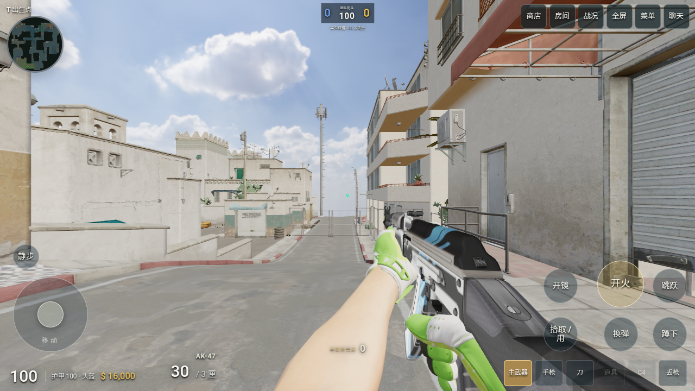
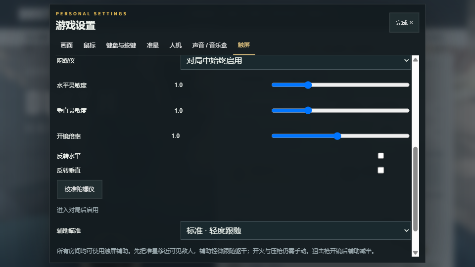
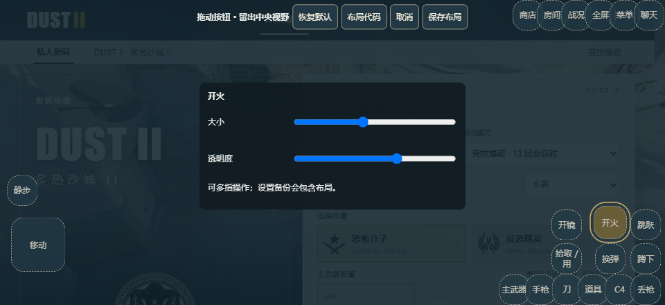

# DUST II · 在线版 1.2.0

**用 GPT-6 做一张能和朋友一起玩的沙二。手机、电脑，同一个房间。**

[进入网页版](https://cs2.duskrain.cn/) · [Android 1.2.0 下载](https://github.com/ETO-ze/dust2-web/releases/tag/online-v1.2.0) · [操作与构建说明](docs/ONLINE-1.2.md) · [验证记录](docs/validation/online-v1.2.0.md)

创建房间，选择 CT / T，邀请异地朋友加入。双方共 10 个席位，人机可填充空位；支持 13 胜爆破、12:12 加时，以及 100 击杀团队死斗。网页与在线安装包互通，服务器统一计算命中、经济和人机行为。

*Android 11 模拟器中的 WebView 游戏截图，连接独立联机测试服务器；不是 P60 真机性能展示。*

## 手机瞄准，更容易上手

在「设置 → 触屏」开启陀螺仪，用手机转动微调视角，手指继续负责转身、开火和走位。默认对局中开启，可改为仅开镜或关闭；两轴灵敏度、开镜倍率、反转和校准独立设置。

轻度辅助瞄准默认开启，先把准星移近可见敌人，再轻微跟随躯干。墙体、烟雾和致盲会取消辅助，主动拉开即可解除；不自动开火、不锁头、不代替垂直压枪。命中仍由联机服务器判定。

正式安卓包继续使用 **WebView**。另提供独立 **GeckoView ARM64 测试包**，与正式包共存、读取相同基础素材、连接同一服务器。**P60 性能对比尚未验收，没有把测试内核替换为正式版。**

*桌面 Chrome 触屏模式的设置检查截图。设置支持本地保存与备份导入。*

## 已有对战功能继续保留

| 改进 | 实际变化 |
| --- | --- |
| 更多守点选择 | 检查落脚位置、视线与路线，随回合轮换，减少重复站位和无效守点。 |
| 有依据的回防 | 根据目击、枪声和队友报告分人支援，另一点留守；真人实际位置参与支援判断。 |
| 更克制的道具决策 | 限制绕路；携包人机需有时间和队友保护，减少为了投掷耽误下包。 |
| 三档人机 | 轻松 / 普通 / 困难，默认普通，由房主调整。普通与困难保留视觉瞄准、平滑转向和连败增强。 |
| 自定义触控布局 | 拖动按键、调整大小与透明度，导入导出布局代码，也纳入设置备份。 |
| 独立帧率上限 | 30 / 60 / 90 / 120 FPS 或不限；手机默认 60，桌面默认不限，只限制渲染。 |
| 安装包读取本地素材 | Android 自带基础地图、默认装备与声音，额外外观按需下载；Windows 保留完整素材。 |

*桌面 Chrome 触屏布局检查截图，960×440 CSS 像素。*

商店、退枪、护甲与拆弹器、五类道具、C4、捡枪丢枪、死亡观战、E 接管人机、聊天和经济系统继续保留。画质、清晰度、亮度、画面比例和准星仍可独立设置。在线对局在打开菜单或切后台后继续进行，返回时重新接收服务器状态。

## 选择你的入口

- **网页：** 直接打开 [cs2.duskrain.cn](https://cs2.duskrain.cn/)，素材按哈希缓存，更新只补下载变化文件。
- **Android 正式包：** 下载 [DustII-Android-1.2.0.apk](https://github.com/ETO-ze/dust2-web/releases/download/online-v1.2.0/DustII-Android-1.2.0.apk)。Android 8+、WebView 110+ 和 WebGL 2；沿用包名和签名，直接覆盖在线旧版，保留设置。基础素材在包内，联机仍需网络。
- **GeckoView 内核测试：** 下载 [DustII-Gecko-Test-1.2.0.apk](https://github.com/ETO-ze/dust2-web/releases/download/online-v1.2.0/DustII-Gecko-Test-1.2.0.apk)。面向 Android 8+ ARM64 手机，可与正式包并存；在「本地资源」导入设置备份。仅用于功能和性能对比。
- **Windows 10/11 x64：** 从[发布页](https://github.com/ETO-ze/dust2-web/releases/tag/online-v1.1.0)下载 ZIP，完整解压，双击「开始游戏-在线联机.cmd」。包内含运行时，无需安装 Node；原有「开始游戏-离线机器人.cmd」也保留。
- **独立纯离线版：** [离线 0.2.0 下载](https://github.com/ETO-ze/dust2-web/releases/tag/offline-v0.2.0)与 [offline-v1 源码](https://github.com/ETO-ze/dust2-web/tree/offline-v1)继续独立保留，可与 Android 在线包共存。

本地资源可以减少重复下载和游戏服务器的带宽争用，但不会消除网络线路延迟。设置备份入口在「本地资源」。P60 真机的温度、持续帧率和触控手感仍需实际验收。

## 开发与来源

Node 22.12+：`npm ci` → `npm run assets:fetch` → `npm run build` → `npm start`。测试使用 `node --test --test-concurrency=2 tests/*.mjs`。安装包构建见[在线版说明](docs/ONLINE-1.2.md)。

参考 [henhaogame/dust2-offline](https://github.com/henhaogame/dust2-offline) 的离线、触控和部分人机设计，复用本项目离线 0.2.0 的独立决策模块，并补充联机适配。

个人体验项目，非 Valve 官方 CS2，也不含 Source 2 引擎。素材、音乐和第三方组件归属见[许可说明](LICENSE.md)与[素材来源](docs/ASSETS.md)。
