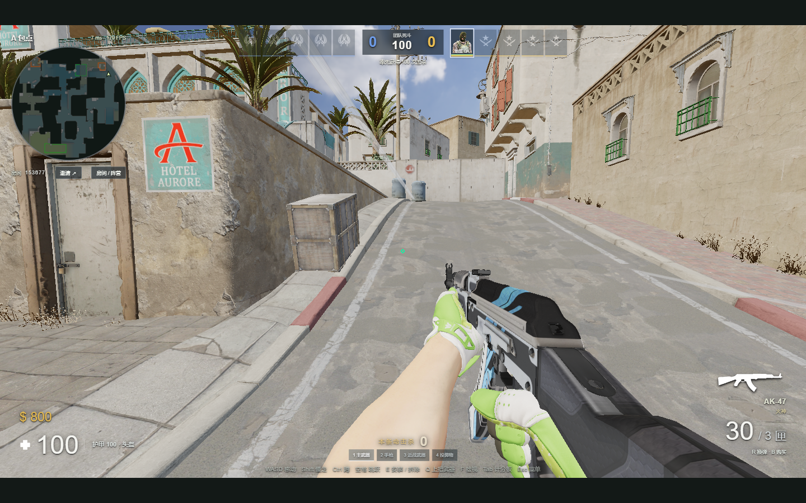
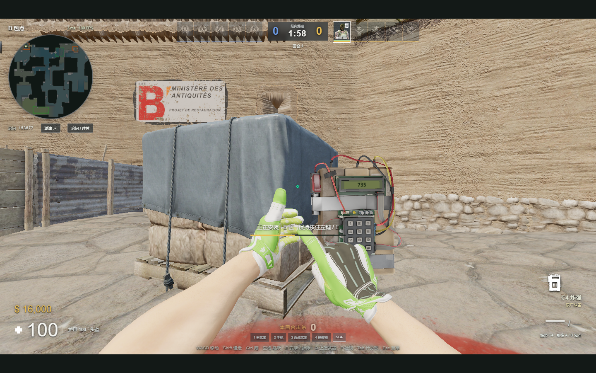
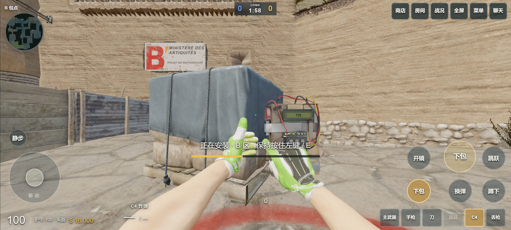

# 预瞄、peek、拾枪与地图修复

2026-09-14 · [在线游玩](https://cs2.duskrain.cn/)

人机现在围绕行进方向和可站立的地图点位预瞄。具备掩体条件时，会先探身观察，停稳后再射击，然后退回掩体。附近看得见的地面枪械会进入拾取判断：空槽补枪、较差的枪换成更好的枪，拾取时保留弹药和皮肤，把旧枪丢在地面。正在交火、执行道具或下包拆包时，优先完成当前动作。

## 连败增强

- 同一队连续输 **2 回合**：人机反应速度与瞄准精度参数增强 **50%**，只触发一档，不累加。
- 连续赢 **2 回合**：恢复房间原来的普通 / 困难基础水平。
- 以稳定的队伍身份计数，半场与加时换边不会把增强转给对手。
- 50% 指反应延迟、瞄准误差按 1.5 倍能力换算，不代表额外伤害或胜率保证。视野、烟雾遮挡、转枪速度上限和停稳要求继续生效。
- 启用与恢复通过本队消息提示，对方不会收到本队的经济计划、请求或队伍消息。

## 地图与 C4

B 狗洞的碰撞补丁扩大到外侧碎砖和窗沿，按已发布的可见场景重建该小块区域。局部过渡面连接碎砖悬出的边缘与 3.255 米窗沿，避免脚底卡在相邻砖块之间。两侧墙和开口保留，客户端和服务器使用相同的生成几何。

A 小的墙面标识、污渍，以及 A 斜坡标线曾离原表面约 **0.394 米**。已将明确命名的 Source 装饰层沿法线收回，典型样本距表面恢复到约 **3 毫米**；原图、UV 和结构墙体不变。桌面和手机共用修复。

C4 数字屏曾把屏幕材质同时套到边框。现在只更新 LCD 的两个三角面，边框沿用原模型材质，数字随下包进度显示。

以上是本地 Chrome 实际渲染截图；手机图使用 915 × 412 CSS 像素的 Android 触屏模拟，不能代替 P60 真机帧率测试。

## 验证

- `node --test --test-concurrency=4 tests/*.mjs`：**331 项通过**，包含枪械确认、聊天隐私、道具、移动和新加入的回归测试。
- B 狗洞：49 个起跳位置 / 方向组合，分别按 30 和 60 Hz 运行，**98 / 98 通过**；完整墙体阻挡与服务器 / 客户端几何一致性仍通过。
- 装饰层：对修复前后几何做射线距离比较，A 小标识、道路标线等典型面的中位间隙从 0.394 米降至约 0.003 米。
- 四套防守方案各模拟 90 秒，观察到真实完成的 peek 循环，且各队均有人使用 AWP 架点。
- 三场 9 人机对局各模拟 240 秒，均有射击、击杀、拾枪、下包和拆包。33 次经过轨迹预检的投掷均通过原落点用途验收，最大预测偏差约 0.196 米。
- 本地模拟服务器单 tick 的 P95 为 **8.6–10.4 毫秒**，低于 30 Hz 的 33.3 毫秒预算；有最高约 68 毫秒的偶发尖峰。这是本地测试结果，不代表公网延迟或服务器长期容量。

## 公网复测

最终线上版本：`20260914T112205Z`。固定地图预瞄点采用最多 1024 项的导航查询缓存，避免每帧重复扫描所有导航节点。

线上创建 1 名测试玩家 + 9 个人机的独立房间，运行 45 秒并关闭：收到 666 份快照，服务器逻辑帧 P95 为 **10.04 毫秒**，RSS 约 **148 MiB**。窗口内仍记录到最高 **186.85 毫秒**的单帧尖峰。它是短时实测，不是长期容量承诺，也不能据此宣称所有卡顿已经消除。

公网三端协议验收确认：己方聊天与经济信息对敌方隐藏，发枪保留持枪者原装备，USP 开火收到服务器确认且弹药从 12 降至 11。更新文件通过 SHA-256 核对，安卓 APK 与专用 Nginx 配置未改动。

## 参考与实现边界

预瞄和探身设计参考 Dignitas 的 [Crosshair Placement](https://dignitas.gg/articles/crosshair-placement-in-csgo) 与 [Peeking Guide](https://dignitas.gg/articles/the-ultimate-guide-to-peeking-a-cs-go-guide)：依据真实头线清角、利用掩体获取信息、区分移动观察和停稳射击。这里实现的是网页人机的简化策略，不是职业选手行为或 Valve AI 的逐帧复刻。

几何修复以本项目已经发布的 Source 2 导出场景为测量基准；没有重新下载整张地图或替换用户的装备缓存。
