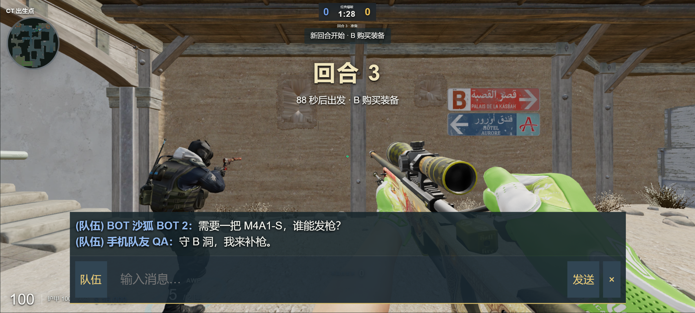

# 2026-09-14 · 人机架点、实际爆头率与队伍交流

在线游玩：[cs2.duskrain.cn](https://cs2.duskrain.cn/)。重新进入即可获取代码更新，未改变的地图、模型与皮肤继续使用本地缓存。

## 守点与狙击

人机到达守点后会观察数秒，再在附近选择能看见入口的可达位置。换位检查高度、路线长度和队友占位；交火、投掷与下包拆包时优先完成当前动作。中门守点改为观察中路、猫道和隧道方向，预瞄点使用地图地面高度与真实视线检测。

AWP 人选从当前人机中按资金选择，真人占用一个席位后仍能分配狙击手。全起且预算充足时可从步枪升级；已有狙击枪时避免重复采购。CT 狙击手分配 A / B 入口架点，停稳开镜，移动与开枪后退镜。保持原有转向速度、反应时间与瞄准稳定时间。

原有八套进攻战术继续使用。修复分散控图阶段跳过队友支援的问题：最近且能够支援的人机会根据队友刚看到的敌情补枪。

## 调整的是实战爆头比例

普通难度以普通真人的瞄准习惯为设计目标，困难以职业选手更重视头线的习惯为目标。步枪、手枪在每次发现对手时选择瞄头或瞄躯干；AWP 主要打躯干。目标被墙体、烟雾遮挡时不能继续跟踪开火。击中哪里仍由实际朝向、散布、后坐力、护甲和服务器射线决定，没有按比例指定某颗子弹爆头。

固定种子的对枪校准：每种难度、每把枪 160 次，距离 8 / 16 / 24 / 32 米，包含站立、蹲姿及横向移动目标，敌人满甲满头。下表只统计完成击杀的对枪；爆头率 = 爆头击杀 / 全部击杀。

| 武器 | 普通 | 困难 | 完成击杀数（普通 / 困难） |
| --- | ---: | ---: | ---: |
| AK-47 | 46.3% | 59.4% | 160 / 160 |
| M4A1-S | 37.5% | 55.6% | 160 / 160 |
| USP-S | 57.4% | 58.6% | 108 / 133 |
| Glock-18 | 51.2% | 57.1% | 86 / 105 |
| AWP | 17.5% | 20.5% | 143 / 151 |

这是本项目的校准样本，不是 CS 官方平均值或职业选手排名。每次对枪上限 9 秒；手枪面对远距离满甲目标会超时，完成样本存在选择偏差。真实对局还受武器组成、距离、走位和玩家操作影响，不保证固定爆头率。面板统计不替代瞄准行为。

## 聊天、要枪与发枪

- **Y：全体聊天；U：队伍聊天；Enter：发送；Esc：取消。** 输入时按 Tab 或点击频道切换全体 / 队伍。中文输入法确认候选字不会直接发送。
- 手机点击右上角「聊天」，默认队伍频道；打开时暂停触屏操作，输入框随可视区域调整位置。
- 聊天标记阵营、阵亡与机器人身份。历史最多保留 50 条，关闭输入框后旧消息淡出；按玩家限制发送频率。
- **B → 队伍补给 → 请求发枪**，可选择本阵营枪械。队友看到请求后直接点击发枪按钮。
- **Ctrl + 点击枪械**可直接购买并丢出。发枪扣真实资金，保留自己手上的枪；赠送的枪带皮肤并实际落地，空槽靠近后自动拾取。
- 缺少主武器的人机会在全起 / 强起时要枪；有主武器、护甲和足够余钱的人机会回应。不会凭空生成枪或钱，死亡、过期、换边及已经取得主武器的人机请求会失效。
- 队伍聊天、要枪请求和 ECO / 半起 / 强起 / 全起计划在服务器按阵营过滤，敌方连接收不到这些字段或事件。



*Chrome 触屏模拟实拍，不能替代华为 P60 的真机键盘与性能测试。*

## 验证与实现参考

- 317 项自动测试通过，包括真实 WebSocket 的队伍隐私、发枪扣款、物理拾取和既有射击确认回归。
- 四套防守阵型各模拟 90 秒：每位守点人机有 6–10 次换位记录；AWP 累计开镜 23–57 秒。该受控样本中没有敌人干扰。
- 八套进攻战术均出现实际射击和道具释放；服务器 tick P95 在本机该样本约 1.8–2.4 ms。这个数字不能用来保证公网延迟或服务器硬件性能。
- 桌面浏览器验证 Y / U、中文合成事件、鼠标重新锁定、文本转义及购买发枪；915 × 412 的触屏模拟验证输入期间移动和开火关闭、手机按钮及购买布局，另验证竖屏和缩小可视区域时输入框仍在画面内。
- 公网版本 `20260914T090609Z`：网页 HTML / JS / CSS 哈希匹配；三人测试房间验证队伍消息与经济信息隔离、P250 发枪扣款 $800 → $500、USP-S 实际扣弹 12 → 11 并收到射击确认。

```bash
node --test --test-concurrency=4 tests/*.mjs
node scripts/qa-bot-aim-rates.mjs
node scripts/qa-bot-holding.mjs
node scripts/qa-strategy-variety.mjs
npm run build
```

行为设计参考 Dignitas 的[职业架点指南](https://dignitas.gg/articles/cs2-how-to-hold-angles-like-pros)和[狙击手职责指南](https://dignitas.gg/articles/learning-roles-with-dignitas-csgo-being-the-awper)。本机 CS2 安装中的 `botprofile.db` 也只定义反应、技能与瞄准偏差等参数，并未给出统一爆头率。本文实现为本项目规则与地图上的适配，不宣称复制了完整职业战队决策。
