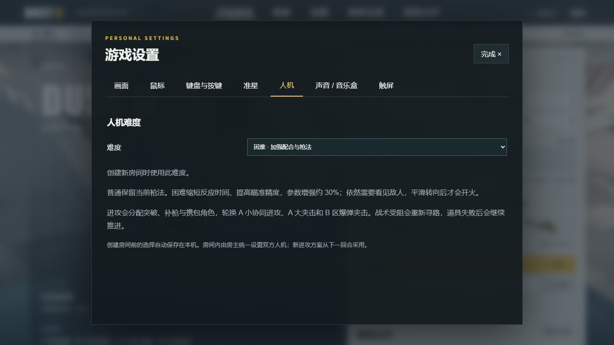
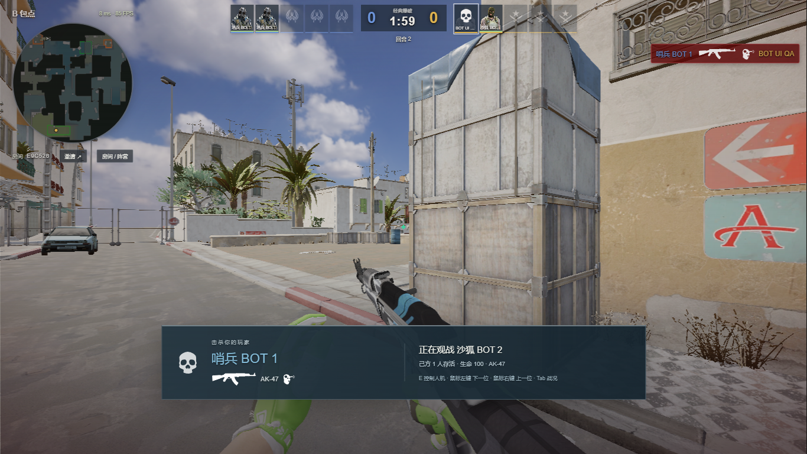
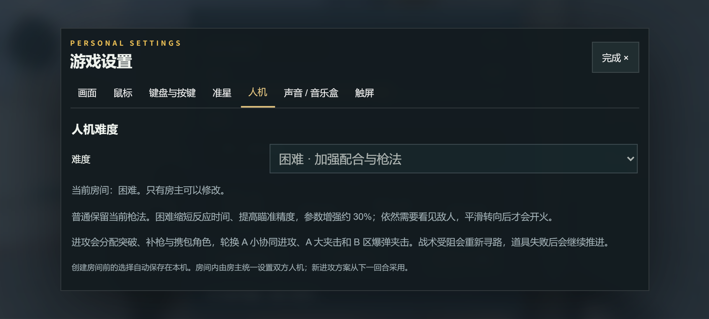

# 人机与 B 狗洞更新 · 2026-09-13

在 [在线游戏](https://cs2.duskrain.cn/) 打开 **设置 → 人机**，即可选择「普通」或「困难」。默认普通，创建房间前的选择会保存到本机；加入已有房间时使用房主的设置。

## 普通与困难

| 参数 | 普通 | 困难 |
| --- | --- | --- |
| 发现目标后的反应延时 | 390–610 ms | 300–469 ms |
| 瞄准误差倍率 | 0.92 | 约 0.708 |
| 最大水平转向速度 | 3.6 rad/s | 3.6 rad/s |
| 对准后稳定时间 | 120 ms | 120 ms |

「约 30%」指反应速度和瞄准精度参数提高到 1.3 倍，并非命中率或胜率保证。两档使用相同武器伤害、视野与遮挡检查。敌人进入视野后平滑转向，被墙或烟遮住时不能继续向隐藏目标瞄准开火。

房主可以在房间内修改双方人机难度。枪法参数即时生效，新的进攻方案从下一回合采用；非房主只能查看当前值。房主离开后，难度保留并由新房主管理。

## 进攻配合与恢复

- **A 小协同进攻**：主队沿 A 小推进，一人从 A 大施压；分配突破、补枪、道具支援和携包任务。
- **B 区爆弹夹击**：B 洞主队与中门侧翼配合。优先烟封视线、燃烧弹清位置，再用闪光配合进入。
- **A 大与 A 小夹击**：与上述方案轮换，避免每回合沿同一条路推进。
- 集结有最长等待时间，不会无限等候已经阵亡或无法到达的队友。困难模式支持连续投掷配合；友方闪光准备时，附近人机会平滑背闪。对真人或其他队友有风险时取消投掷。
- 敌情来自可见目标和短时共享信息；守点人机会小范围换位，附近队友遇敌时优先派最近的可用队员补枪。
- 同一目标的有效路线继续执行，避免频繁重算导致折返。确实移动受阻约 2.2 秒后，尝试侧移、后退、蹲跳，并暂时避开失败边；连续失败可改走另一条进攻路线。守点、冻结、架枪与下拆包不会被误判为卡住。
- 失败的投掷点暂时停用，转回持枪与推进。所有投掷点都使用本项目实际地图和投掷物理验证，小幅站位、角度扰动也纳入检查。

这些是按用户提出的 Astralis A 小进攻、Vitality 爆弹思路设计的网页游戏行为，不是职业队内部战术手册或特定比赛的逐帧复刻。

## 地图与观战

B 狗洞破损砖墙的旧碰撞与可见模型存在局部偏差。本次在小范围内重建对应碰撞，范围外保留原几何和穿透材质映射；服务器 JSON 与浏览器二进制地图使用相同补丁。真实墙体与窗台继续阻挡，窗口双向蹲跳已验证。

对窗口局部发射 528 条对照射线，碰撞比可见表面提前超过 4 cm 的情况从 76 处降为 0。该结果只覆盖这次检查的 B 窗区域。

Valve 的 [Dust II 改版说明](https://www.counter-strike.net/dust2/) 曾明确描述放宽 B Window 通行与简化附近障碍的方向。该资料来自 CS:GO 改版，不能代替当前 CS2 的精确尺寸；本次几何修正依据项目正在显示的地图模型。

观战存活人机现在显示玩家自己的准星设置；狙击镜等瞄准界面继续按被观战武器显示。死亡镜头阶段不会提前显示存活准星。

## 验证

- 271 项 Node 测试通过，包含房主权限、联网同步、普通默认值、视线限制、平滑转向、寻路恢复、投掷验证、B 窗双向穿越和台阶回归。
- 桌面 Chromium 实际创建困难房间、保存设置、死亡观战；安卓尺寸模拟检查设置面板与非房主权限。
- 3 组各 110 秒、9 名人机的本地导航和满配道具模拟，实际执行 A 小及 B 区烟、火、闪；单 tick P95 为 1.76–1.89 ms。这是本机模拟耗时，不代表公网延迟或手机帧率。
- 锁定的 1,569 个资产完整性检查通过。画质、皮肤下载和手机清晰度档位继续沿用当前版本。

复查命令：`node --test --test-concurrency=4 tests/*.mjs`、`node scripts/audit-bot-routes.mjs hard review`、`npm run build`。

