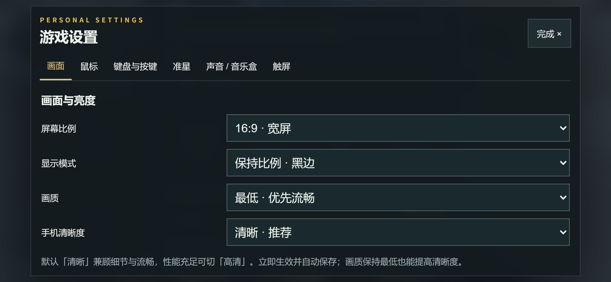
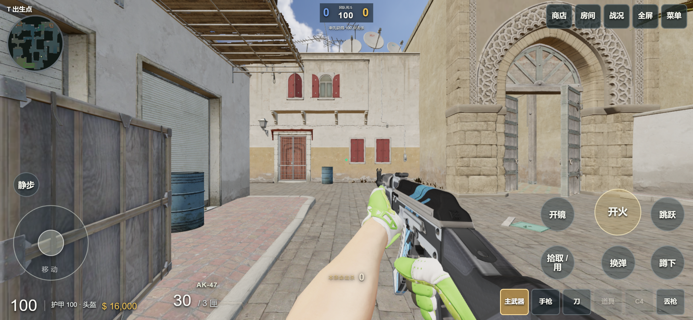

# 手机清晰度更新 · 2026-09-13

手机画面发糊的两个原因是默认渲染分辨率偏低，以及上一版为解决加载卡死把地图贴图统一缩到了 256 像素。本次把清晰度和阴影画质分开：保持「最低」画质也能看清墙面、远处轮廓和武器皮肤。

打开 **设置 → 画面 → 手机清晰度**。默认「清晰」；P60 可以先使用这一档，觉得仍不够锐利且运行流畅时切「高清」。三个档位立即生效、自动保存，旋转屏幕时重新计算，不放大 HUD 或触屏按钮。安卓全屏客户端加载同一网页，无需重新安装 APK。

## 实际变化

| 项目 | 上一版手机档 | 当前手机档 |
| --- | --- | --- |
| 默认渲染，844×390 CSS、DPR 3 | 844×390 | 1688×780，即 4 倍像素数量 |
| 地图颜色贴图长边上限 | 256 | 512 |
| 法线、粗糙度等辅助贴图上限 | 256 | 128，使用无损 WebP 保存数据 |
| 手机武器、探员贴图长边上限 | 512 | 1024 |
| 地图各向异性过滤 | 1 | 4，实际由显卡能力限制 |
| 抗锯齿 | 关闭 | 创建手机渲染器时请求 MSAA |

「省电」最多约 92 万渲染像素，「清晰」最多 160 万，「高清」最多 240 万，同时不超过设备像素密度。上限用于控制高 DPI 屏幕的显存和填充开销，不能保证每台手机达到相同帧率。

地图解码后的基础 RGBA 估算为 209.6 MiB，原始桌面贴图为 937.7 MiB；该数字不包含 mipmaps、几何、武器探员、帧缓冲或驱动开销，不等同于整个游戏内存。颜色贴图优先保留细节，辅助纹理使用较低分辨率；维持四个并行解码、超时可重试和旧图像释放逻辑。

手机基础资源清单仍为 924 个文件，总计约 133.0 MiB；旧版手机档约 120.6 MiB。首次更新需要获取新地图贴图；已有的共享声音、几何和其他相同哈希资源继续复用缓存。几何、UV、材质对应关系和碰撞数据没有更改，桌面继续使用原桌面贴图。

*本地 Chrome 的手机模拟截图，未修图。浏览器模拟可验证布局、加载和渲染尺寸；此截图不是 P60 真机画面，也不能代表 P60 帧率。*

## 验证与发布

[机器可读验收记录](MOBILE-CLARITY-ACCEPTANCE.json)记录了三个档位、四种窗口尺寸、抗锯齿、错误状态和重载保存。844×390 的「高清」实际缓冲为 2279×1053；横竖屏均保持 CSS 尺寸一致，像素预算没有超限。三个档位均加载成功，未发生上下文丢失或页面错误。

运行 `node --test --test-concurrency=4 tests/*.mjs` 检查逻辑，`python deploy/test-mobile-graphics.py` 检查发布包边界和资源完整性；构建使用 `npm run build`。一次无并发上限的全套运行遇到既有 WebSocket 测试响应超时，该文件单独复测通过，随后限制测试并发复测全套，258 项全部通过；客户端发布器 7 项和图形补丁 9 项校验也全部通过。

客户端通过 `deploy/mobile-graphics-hotfix.py` 发布：只允许首页、前端包、手机资源清单和新手机地图文件；先校验现有共享依赖，再备份、写资源、最后更新入口。保留旧哈希资源供已打开页面继续使用，检查服务器 PID 未改变。服务器逻辑和 APK 不在此补丁的写入范围。

实现参考 Three.js 官方的[高 DPI 渲染说明](https://threejs.org/manual/en/responsive.html)、[WebGLRenderer](https://threejs.org/docs/pages/WebGLRenderer.html)和[纹理参数](https://threejs.org/docs/pages/Texture.html)。这些资料解释像素密度与过滤；档位预算来自本项目的实现和上述本地验证，并非官方 P60 性能承诺。
