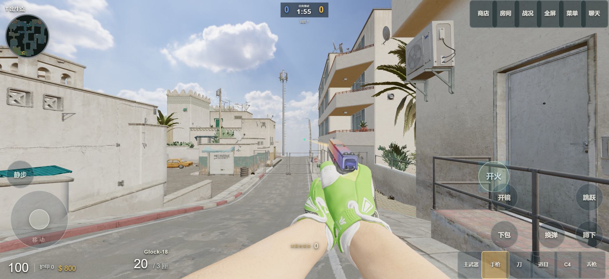

# DUST II · 离线测试版

**用 GPT-6，把沙二变成随时可以打开的本地对局。**

[下载 Android APK / Windows ZIP](https://github.com/ETO-ze/dust2-web/releases/tag/offline-v0.1.0) · [使用与构建说明](OFFLINE-V1.md) · [原在线版本](https://github.com/ETO-ze/dust2-web/tree/main)

这是独立的离线测试分支。地图、枪械、皮肤、探员和音乐全部随包提供；安卓与电脑版分别下载，首次开局无需联网。1 名玩家与最多 9 名人机，支持 5v5 席位、竞技爆破、团队死斗和普通/困难难度。

[查看验证记录](validation/offline-v0.1.0.md) · [Android 安装运行截图](screenshots/offline-android-v1.png) · [Windows 运行截图](screenshots/offline-desktop-v1.png)

## 这一版重点

- 人机、物理与回合逻辑放进独立 Worker，避免直接占用画面线程。
- 沿用原版弹道、经济、人机战术、两连败增强规则；保留完整商店、五种道具、捡枪丢枪和死亡观战。
- 自定义触屏布局：拖动按钮、调大小/透明度、导入导出代码，设置自动保存。
- 默认最低画质、60 FPS 上限；保留清晰度、亮度和 16:9 / 4:3 设置。
- 打开暂停菜单、切后台暂停对局，返回继续。退出后重新开局。
- 完整安装资源直接读取，不再在浏览器缓存额外复制整套地图。

## 开始测试

**安卓**：安装 APK，从「尘雨 Dust II 离线」启动。与原在线版可共存。需要 Android 8+、WebGL 2 与 WebView 110+。

**Windows 10/11 x64**：完整解压 ZIP，双击「开始游戏.cmd」，使用 Edge/Chrome；保留启动窗口直到结束。包内已含运行时，无需安装开发环境。

这是个人离线测试版，不是 Valve 官方 CS2，也不包含 Source 2 引擎。当前不提供联机和局内存档。素材、音乐及第三方组件归属见 [许可说明](../LICENSE.md) 与 [素材来源](ASSETS.md)。

参考 [henhaogame/dust2-offline](https://github.com/henhaogame/dust2-offline) 的完整资源与触控布局思路，采用独立模块重新实现；详细取舍见 [版本说明](OFFLINE-V1.md)。
