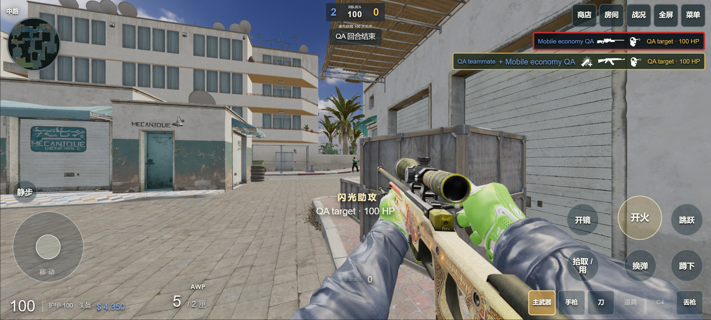
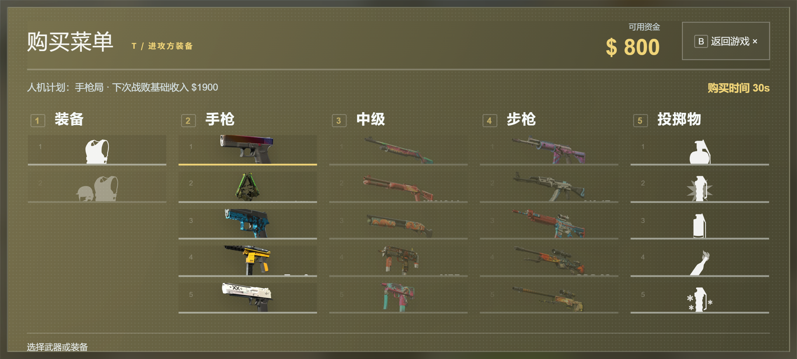
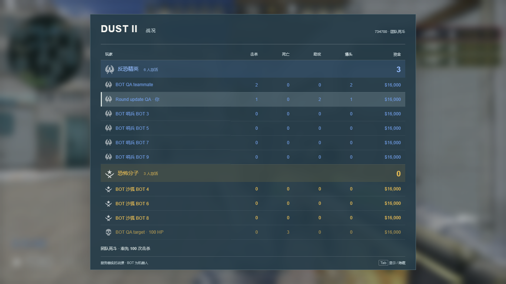

# 2026-09-14 · 回合战斗、助攻与人机经济

在线游玩：[cs2.duskrain.cn](https://cs2.duskrain.cn/)。重新进入游戏即可获取本次更新；已校验且未修改的资源继续使用本地缓存。

## 击杀与回合结束

- 爆头击杀使用独立图标和提示，战绩表新增爆头击杀数。普通命中与爆头伤害继续由服务器判定。
- 同一条生命中累计造成至少 40 点实际生命伤害，队友完成击杀后记一次伤害助攻。护甲吸收的部分不累计。
- 敌人受到至少 0.5 秒有效闪光后，在失明结束后 1 秒内被队友击杀，可获得闪光助攻。优先记给满足门槛、伤害最高的贡献者；没有伤害助攻时再选闪光贡献者。每次击杀最多一名助攻，助攻不增加团队击杀分。
- 接管人机时产生的贡献计给操作者；复活清除上一条生命的受伤记录。
- 回合结束到下一回合冻结前，存活玩家可以开枪、丢枪、拾枪和投掷。已经确定的回合胜负与比分不会被追加击杀改写。整场比赛结束后仍进入最终结算。

## 沙二人机

进攻包括 A 小集结、A 大小夹击、A 大提速、B 洞爆弹、中路夹 B、B 洞静步接触、分散控图转点、佯攻 A 转 B。最近两次使用的战术会避开，并根据己方装备调整选择权重。站位与队内分工每回合变化，队友阵亡不会让剩余人机不断重走开局路线。

控图转点只参考队友实际看到且尚未过期的敌情。佯攻与集结都有等待上限；防守侧轮换均衡布防、A 大抢控、偏 B 防守和中路施压。枪法依旧采用视线检测、反应时间与平滑瞄准，本次没有额外提高枪法参数。

## 经济与保枪

| 决策 | 行为 |
| --- | --- |
| 手枪局 | 分配护甲、烟闪与少量拆弹器。 |
| 全起 | 综合己方现金和保留装备，优先主武器、护甲和必要道具；资金充足时分配一把 AWP。 |
| 半起 | 限制本回合预算，尽量保证下一次战败收入到账后能够起齐基础长枪装备。 |
| ECO | 全队少买或不买，避免每局各自买冲锋枪把经济花空；仍会执行进攻与防守。 |
| 强起 | 对手赛点、半场最后一回合、加时经济重置前，或多数队友已保有主武器时投入现有资金。 |

保留的武器不重复购买。CT 普通整备最多安排两套拆弹器，避免人人先买拆弹器却没钱买枪。残局回防时间已经不足，或人数严重劣势且没有有效拆弹时，持有高价值主武器的 CT 会尝试撤退保枪；可完成的拆弹仍有人执行与掩护。

战败基础收入按 1400 / 1900 / 2400 / 2900 / 3400 阶梯变化，半场起始档为 1900；获胜下降一档，失败上升一档，上下均有边界。常规胜利 3250，炸弹爆炸或拆除胜利 3500；T 下包后输掉回合增加 800，未下包超时仍存活的 T 没有战败收入。换边与加时按现有规则重置经济。

**购买计划仅己方可见。** 商店与战绩表显示本队人机的购买计划；服务器在首次加入和持续同步时都会剔除敌方的计划字段，并按阵营复用序列化结果。真人购买仍由自己决定。

## 投掷物音效

从本机 CS2 安装文件导出对应原始音频，补充拔销、投出、碰撞、起烟、点燃、点燃失败和远距离声音。燃烧瓶与 CT 燃烧弹分别使用各自音效，诱饵持续发声使用模拟武器的枪声。距离与方向影响音量、左右声道；解码缓存和同时播放数量仍有上限。

本次新增约 0.82 MiB 音频，基础清单变为 948 个文件：桌面约 202.1 MiB，手机约 133.8 MiB。完整可选资源锁定清单为 1593 个文件。

## 设计参考与验证范围

参考 Dignitas 的 [Dust2 控图与分路进攻](https://dignitas.gg/articles/default-strategies-for-t-side-on-de_dust2)、[烟闪火配合](https://dignitas.gg/articles/fundamental-utility-for-the-t-side-on-dust2-in-csgo)和 [CS2 经济决策](https://dignitas.gg/articles/cs2-economy-tips-managing-money-for-competitive-wins)。这些用于设计配合原则，具体路线、等待时间、买枪阈值和保枪条件是本项目的实现，不是职业队比赛数据训练模型，也不宣称完整复刻 Source 2。历史经济起始档参考 [Valve 官方说明](https://blog.counter-strike.net/2018/10/21320/)。

305 项自动测试通过。验证包括服务器射击与拾枪、冻结阶段隔离、爆头和助攻归属、ECO 后恢复整备、连续失败收入、真实 WebSocket 阵营隐私，以及桌面和手机触控浏览器操作。八套战术分别在真实地图物理场景运行，均产生移动、交火与投掷。手机测试使用 Chrome 设备模拟，不能代替 P60 真机性能测试。

以上为本地测试房间截图，角色与击杀由专用验证场景生成，用于检查 UI 与服务器事件链路。
