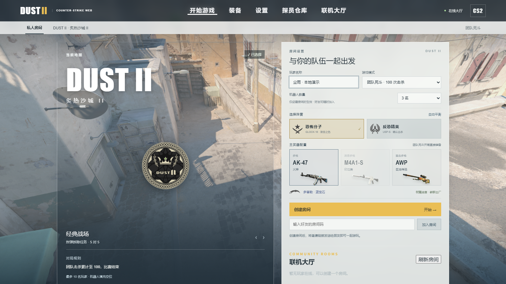
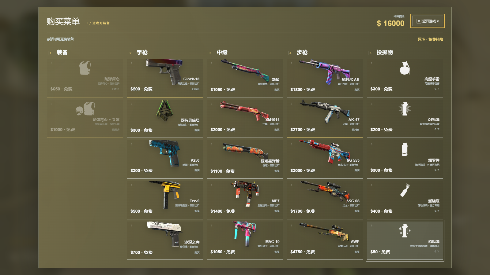
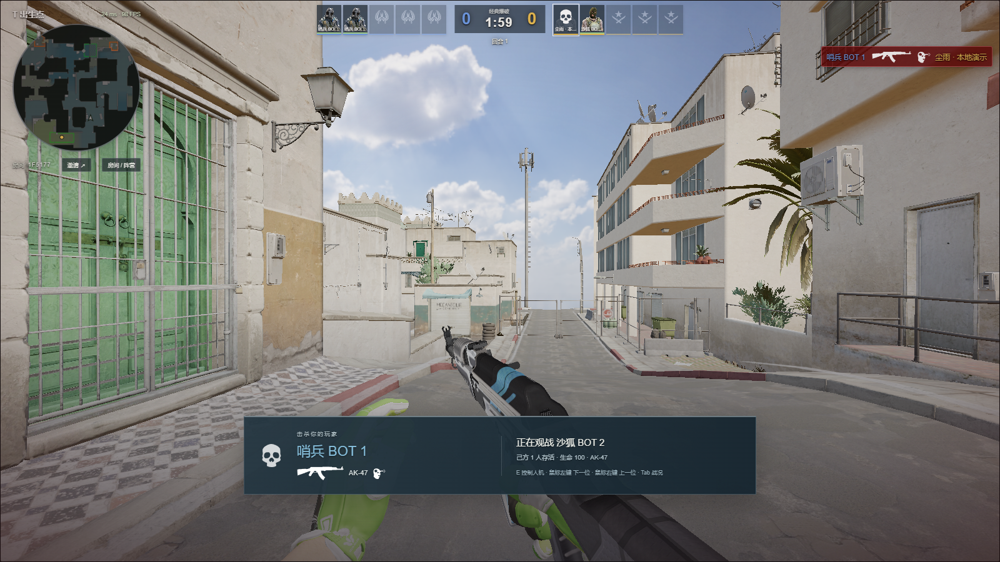

# DUST II · 当前版本实机

[立即开局](https://cs2.duskrain.cn/) · [返回项目介绍](../README.md)

这里只展示 2026-09-13 当前客户端的界面与游戏画面。桌面截图重新取自相同构建的本地浏览器，手机截图取自本次清晰度验收。图片未裁切、调色或合成；来源、尺寸和 SHA-256 见[当前截图清单](screenshots/current-manifest.json)。

## 一张链接，进入房间

填好名字后创建房间，也可从联机大厅加入已有对局。演示使用本机服务器，没有加入或干扰公网玩家的房间。

每边五个固定席位。玩家点击空位选队，房主在空位添加人机，复制邀请链接后发给朋友。

## 在沙城里交锋

地图、手臂与武器在同一帧中运行，场景由网页渲染。默认装备、雷达、比分和弹药来自当前对局状态。

B 打开装备面板，按阵营显示枪械、护甲、头盔、道具与拆弹器。图中是团队死斗演示；爆破购买由服务器检查资金、区域和时间。

## 阵亡后继续参与

本地验收工具触发了死亡和爆破观战状态，显示真实击杀者、观战目标和接管入口。这是功能演示，不是公开比赛战绩。按 E 接管正在观战且无人控制的己方人机，手机使用「控制人机」按钮。

## 手机画面

左侧摇杆、右侧瞄准与战斗按钮，中央保留观察空间。当前默认清晰档在 844×390 CSS 窗口下使用 1688×780 渲染缓冲。

最低画质和清晰度分开控制，三个档位即时生效并保存。手机截图使用桌面 Chrome 的触屏设备模拟，不代表 P60 真机帧率或发热表现。

参数和校验见[手机清晰度更新](MOBILE-CLARITY.md)、[当前验证说明](STABILITY.md)。截图中的 Counter-Strike 素材归 Valve 及相应权利人。
