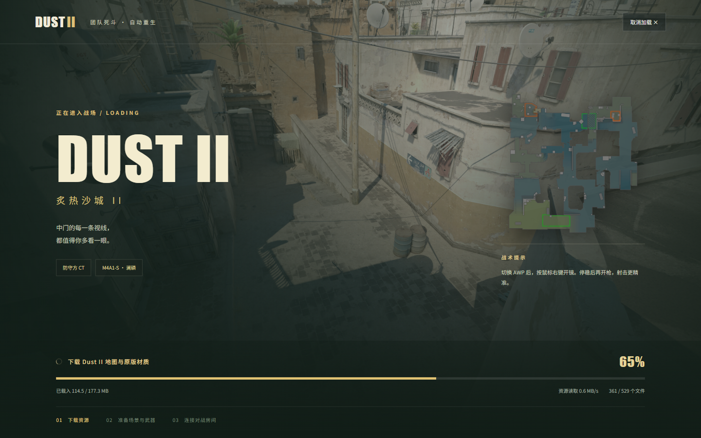

# DUST II · 游戏实拍

下面 8 张图来自本项目在浏览器中的实际运行与验收过程。图片保留原始 PNG，未裁切、调色、合成或生成；拍摄于 2026-09-08，不同截图来自当天不同构建阶段，界面细节与资源数量可能随版本变化。原图来源、尺寸及 SHA-256 记录在[截图清单](screenshots/manifest.json)。

[在线试玩](https://duskrain.cn/dust2/) · [返回项目介绍](../README.md)

## 01 / 沙城，第一视角

熟悉的街道向中路延伸，武器握在真正的手臂模型中。这张图展示地图、第一人称骨骼、皮肤、雷达与战斗 HUD 在同一帧中的实际效果。AWP 巨龙传说是按需下载的可选皮肤，默认 AWP 为永恒之枪。

来源：`output/playwright/awp-dragon-live.png`。实时 3D 对局画面，原始尺寸 2560 × 1273。

## 02 / 枪响之后，结果明确

命中、扣血、击杀，由服务器确认后再呈现到屏幕。中央击杀徽章、右上角击杀信息与顶部比分共同反馈这一枪的结果。

这是一张**本地联机验证房间**截图，对手为名称中注明的「QA CT · 100血100甲」测试目标。游戏执行正常开火与命中判定；图片用于展示真实击杀反馈，不包装为公开比赛战绩。它来自当天较早构建，底部操作提示可能与当前版本略有不同。

来源：`output/playwright/upgrade-confirmed-kill.png`。实时 3D 对局与服务器事件，原始尺寸 1440 × 900。

## 03 / 下一把，换一种打法

B 键打开装备商店，从步枪到 AWP，一眼看到当前武器、资金与购买结果。团队死斗提供免费补给，爆破模式则由服务器检查购买条件。

来源：`output/playwright/public-cs-shop.png`。公网游戏内商店截图，原始尺寸 2560 × 1273。装备卡片中的图片为武器库存预览图；背景来自正在运行的对局。

## 04 / 把常用装备留给自己

按武器浏览皮肤，查看当前装备与额外下载大小。点选喜欢的外观后才获取模型，并把选择保存在当前浏览器；进入房间时，其他玩家也能看到相应外观。

来源：`output/playwright/skin-menu-integrated.png`。运行中的皮肤仓库界面，原始尺寸 2560 × 1273。这里展示库存预览图与实际 UI，第一张实机截图展示了装备后在 3D 场景中的效果。

## 05 / 把等待留在第一次

地图、枪械、动作与声音保存在当前浏览器中，后续进入复用本地文件。更新按变化的资源补齐，额外皮肤仍然按需获取。

图中「185.0 MB / 590 个」是截图时实际保存的基础资源状态，不是所有后续版本的固定大小。PWA 提供桌面入口；离线大厅可以使用已缓存页面，对局仍需连接服务器。

来源：`output/playwright/local-cache-complete.png`。本地资源管理界面实拍，原始尺寸 2560 × 1273。

## 06 / 等待，也知道进度

加载页把过程分成下载资源、准备场景与武器、连接对战房间三个阶段。进度条呈现真实传输进度与文件数量，并保留取消及失败重试入口。

来源：`output/playwright/upgrade-public-loading.png`。公网加载界面，原始尺寸 1440 × 900；截图为当天较早版本。背景是地图展示图，这一张**不作为实时 3D 渲染效果的证据**。

## 07 / 阵亡，留在战场

镜头留在刚才的交火位置，场景仍然可见；击杀者、武器、爆头标记和自动重生倒计时集中在底部。等待结束后，由服务器确认重生并恢复控制，玩家无需再点击「继续游戏」。

来源：`output/playwright/death-screen-qa.png`。本地联机验收房间中的阵亡画面，原始尺寸 2560 × 1273。该图用来核验死亡 UI 与自动重生流程，不代表公开匹配战绩。

## 08 / 看队友打完这一回合

爆破回合仍在进行：阵亡后镜头跟随存活队友，面板显示对方名称、当前生命、武器以及己方存活人数。左键查看下一位，右键返回上一位；这一回合的结果仍值得等到最后。

来源：`output/playwright/spectator-screen-qa.png`。本地联机验收中的爆破存活队友观战，原始尺寸 2560 × 1273。截图时回合处于进行状态，画面中「正在观战 沙狐 BOT 4」为真实跟随目标；这是功能验收场景，不包装为竞技比赛。

死亡与观战流程参考 [Valve Spectator UI](https://blog.counter-strike.net/2012/08/4839/) 中保留队友身份、武器和生命信息的设计思路，网页界面由本项目独立实现。

## 图片与素材归属

截图记录本项目网页界面与游戏运行结果。其中可见的 Counter-Strike 地图、武器、皮肤及相关素材归 Valve 及相应权利人所有；Quaternius 等角色素材按各自许可使用。本页面的展示不改变这些素材的权利归属，也不代表 Valve 官方作品或背书。

查看[项目说明与当前限制](../README.md#当前边界)，以及[资源获取与归属说明](ASSETS.md)。
